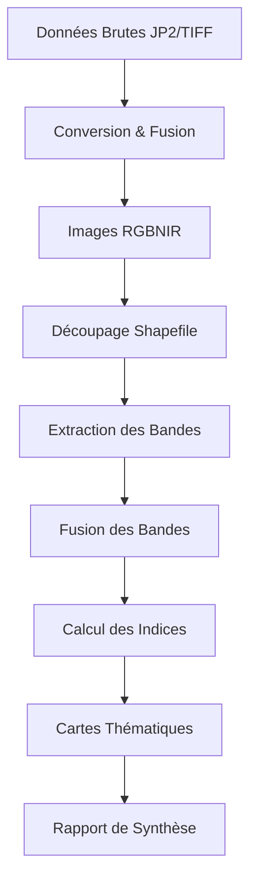

# Documentation Technique

## Architecture du Package

### Structure Modulaire

Le package `ortho_processor` est organisé en modules spécialisés :

```
ortho_processor/
├── __init__.py              # Point d'entrée du package
├── downloader.py            # Gestion du téléchargement des données
├── converter.py             # Conversion JP2→TIFF et fusion des bandes
├── vegetation_indices.py    # Calcul optimisé des indices de végétation
├── thresholding.py          # Seuillage et cartes thématiques
├── main_processor.py        # Orchestrateur principal
└── config.py               # Configuration et profils prédéfinis
```

### Flux de Traitement



## Optimisations Mémoire

### Traitement par Blocs

Tous les modules utilisent un traitement par blocs pour gérer de gros fichiers :

```python
for ji, window in src.block_windows(1):
    block = src.read(1, window=window)
    # Traitement du bloc
    dst.write(processed_block, 1, window=window)
    del block  # Libération mémoire
    gc.collect()
```

### Gestion des Types de Données

- **Entrée** : uint16 (0-65535) pour les données brutes
- **Normalisation** : float32 (0.0-1.0) pour les calculs
- **Indices** : float32 pour préserver la précision
- **Cartes** : uint8 (0/255) pour les masques binaires

### Parallélisation

Utilisation de `joblib` pour les opérations coûteuses :

```python
Parallel(n_jobs=4)(
    delayed(function)(args) 
    for args in argument_list
)
```

## Indices de Végétation

### Formules Implémentées

| Indice | Formule | Constantes |
|--------|---------|------------|
| NDVI | (NIR - R) / (NIR + R) | - |
| SAVI | (1 + L) × (NIR - R) / (NIR + R + L) | L = 0.5 |
| EVI | G × (NIR - R) / (NIR + C1×R - C2×B + L) | G=2.5, C1=6, C2=7.5, L=1 |
| AVI | [NIR × (1-R) × (NIR-R)]^(1/3) | - |
| BI_NIR | (R + G + B + NIR) / 4 | - |
| RATIO | NIR / (R + G + B) | - |
| BSI | ((R+G)+(NIR+B)) / ((R+G)-(NIR+B)) | - |

### Gestion des Valeurs Spéciales

- **Division par zéro** : Masquage avec `mask = denominator != 0`
- **Racines négatives** : Gestion spéciale pour AVI
- **Valeurs aberrantes** : Masquage des pixels > 65535 ou < 0

## Cartographie Thématique

### Système de Seuillage

Chaque zone thématique peut avoir plusieurs conditions :

```python
conditions = [
    {"index": "NDVI", "operator": ">", "threshold": 0.4},
    {"index": "SAVI", "operator": ">", "threshold": 0.3}
]
```

Les conditions sont combinées avec un **ET logique**.

### Opérateurs Supportés

- `>` : Supérieur strict
- `<` : Inférieur strict  
- `>=` : Supérieur ou égal
- `<=` : Inférieur ou égal

### Format de Sortie

Les cartes thématiques sont des rasters uint8 :
- **255** : Zone détectée (conditions satisfaites)
- **0** : Zone non détectée

## Configuration Système

### Dépendances Critiques

```bash
# GDAL (système)
sudo apt-get install gdal-bin python3-gdal

# Python (pip)
pip install rasterio fiona numpy tqdm joblib shapely
```

### Variables d'Environnement

```bash
export GDAL_DATA=/usr/share/gdal
export PROJ_LIB=/usr/share/proj
```

### Paramètres de Performance

```python
# Taille des blocs (mémoire vs performance)
block_size = 2048  # Pixels

# Nombre de processus parallèles
n_jobs = min(4, cpu_count())

# Type de compression
compress = "lzw"  # Bon compromis taille/vitesse
```

## Formats de Fichiers

### Profils Raster Standard

```python
profile = {
    'driver': 'GTiff',
    'dtype': 'float32',  # ou 'uint16', 'uint8'
    'nodata': None,
    'width': width,
    'height': height,
    'count': 1,  # ou 4 pour RGBNIR, 7 pour composite
    'crs': 'EPSG:2154',  # Lambert 93
    'transform': transform,
    'compress': 'lzw',
    'BIGTIFF': 'YES'  # Pour fichiers > 4GB
}
```

### Convention de Nommage

```
ORTHO_RGBNIR_{resolution}_EPSG{crs}_D{dept}.tif
vegetation_indices_composite.tif
{zone_name}_map.tif
```

## Gestion d'Erreurs

### Erreurs Communes

1. **GDAL non installé**
   ```python
   try:
       import rasterio
   except ImportError:
       print("Installer rasterio: pip install rasterio")
   ```

2. **Mémoire insuffisante**
   ```python
   # Réduire la taille des blocs
   block_size = 1024  # Au lieu de 2048
   ```

3. **CRS incompatibles**
   ```python
   if src.crs != shapefile_crs:
       raise ValueError("CRS incompatibles")
   ```

### Logging et Debug

```python
import logging
logging.basicConfig(level=logging.INFO)
logger = logging.getLogger(__name__)

logger.info(f"Traitement du fichier: {filepath}")
logger.debug(f"Statistiques: min={min_val}, max={max_val}")
```

## Tests et Validation

### Tests Unitaires

```python
def test_ndvi_calculation():
    nir = np.array([[100, 200]], dtype=np.float32)
    red = np.array([[50, 100]], dtype=np.float32)
    
    expected = (nir - red) / (nir + red)
    result = calculate_ndvi(nir, red)
    
    np.testing.assert_array_almost_equal(result, expected)
```

### Tests d'Intégration

```bash
python test_demo.py  # Test complet avec données synthétiques
```

### Benchmarks

```python
import time

start = time.time()
# Code à benchmarker
elapsed = time.time() - start
print(f"Temps d'exécution: {elapsed:.2f}s")
```

## Extensibilité

### Ajout d'Indices Personnalisés

1. Modifier `_compute_indices_block()` dans `vegetation_indices.py`
2. Ajouter la formule et les métadonnées
3. Mettre à jour les statistiques recommandées dans `config.py`

### Nouveaux Formats d'Entrée

1. Étendre `_read_raster()` dans `converter.py`
2. Ajouter les transformations nécessaires
3. Tester avec le nouveau format

### Algorithmes de Seuillage

1. Créer une nouvelle classe héritant de `VegetationThresholder`
2. Implémenter la méthode `_apply_custom_threshold()`
3. Intégrer dans le workflow principal

## Maintenance

### Mise à Jour des Dépendances

```bash
pip list --outdated
pip install --upgrade rasterio fiona numpy
```

### Nettoyage des Fichiers Temporaires

```python
import shutil
shutil.rmtree(work_dir)  # Suppression récursive
```

### Surveillance des Performances

```bash
htop  # Surveillance CPU/mémoire
iotop # Surveillance I/O disque
```
